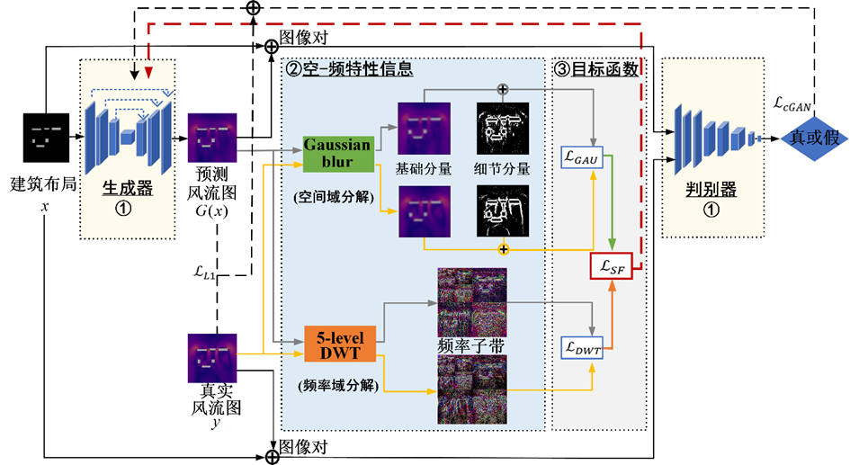

<h2 align="center">Pedestrian wind flow prediction using spatial-frequency generative adversarial network</h2>
Pedestrian wind flow prediction using spatial-frequency generative adversarial network[J]. Building Simulation, 2023: 1-16．

